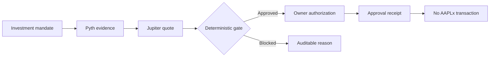

<p align="center">
  
</p>

<h1 align="center">ValueCurator</h1>

<p align="center"><strong>Evidence-gated execution for autonomous finance.</strong></p>

<p align="center">
  Guarded authorization infrastructure for tokenized stocks and other real-world assets on Solana.
</p>

> **Public product identity:** ValueCurator  
> **Technical core:** KAIROS Engine / `kairos_engine`

ValueCurator turns an investor mandate into deterministic execution rules. Before an autonomous agent can proceed, the system verifies the asset, Pyth reference data, Jupiter executable quote, price age, confidence, deviation, price impact and persistent risk limits. AI may advise, but it cannot hold keys, alter custody or bypass policy.

**Live Stocklana demo:** [https://www.valuecurator.xyz](https://www.valuecurator.xyz) · English UI · approval-only (no AAPLx trade submitted).

## Stocklana demo status

| Item | Status |
| --- | --- |
| Public dashboard | [https://www.valuecurator.xyz](https://www.valuecurator.xyz) · English · HTTPS |
| Solana program | Deployed on Devnet |
| Program ID | `6owAcXj4FxJom96cEX9CSFjGrg6zp4U8atTjrpCUMiW5` |
| Market evidence | Live AAPL/USD through authenticated Pyth Pro |
| Executable quote | Live USDC → AAPLx read-only Jupiter quote |
| Decision policy | Deterministic, fail-closed and auditable |
| AAPLx execution | Approval-only; no Mainnet transaction is submitted |
| AI custody | None |
| Test coverage | 63 agent tests and 9 Anchor E2E scenarios |
| License | Apache-2.0 · see `LICENSE` |
| Video | 3-minute demo recorded · link pending in this README |

[Open the public ValueCurator dashboard](https://www.valuecurator.xyz)  
[View the deployed program on Solana Explorer](https://explorer.solana.com/address/6owAcXj4FxJom96cEX9CSFjGrg6zp4U8atTjrpCUMiW5?cluster=devnet)

### Judge walkthrough (≈3 minutes)

1. Open [https://www.valuecurator.xyz](https://www.valuecurator.xyz) → **Start demo** (Gate).
2. **Block · stale price** (or divergence) → decision **BLOCKED** · no transaction.
3. **Safe · APPROVED** → simulation approved · unsigned / not an AAPLx submission.
4. **Audit** → final report separates authorization from execution; Devnet custody events are not an AAPLx trade.

## Team

| Name | Background |
| --- | --- |
| Sandra Pereira | Master's in Informatics, PUC Minas |
| João Nitzsche | Computer Engineering, ITA |

## Business

ValueCurator is guarded authorization infrastructure for tokenized stocks and other real-world assets on Solana. The buyer is an investor or operator who wants autonomous agents to act on a mandate without giving those agents custody or the ability to bypass policy.

The product turns that mandate into deterministic rules: Pyth reference data and a Jupiter executable quote must pass age, confidence, deviation and risk limits before authorization. AI may advise; it never holds keys. The Stocklana demonstration proves that gate—approval or block with an auditable receipt—not a submitted AAPLx trade.

## The problem

Financial agents can operate continuously, but a compromised operator, stale price, incorrect asset, excessive slippage or malformed AI recommendation can move capital outside the owner's intent. Standard wallet permissions cannot express rules such as:

- permitted assets;
- maximum trade and daily amounts;
- maximum data age and confidence ratio;
- maximum reference/executable-price deviation;
- maximum slippage and price impact;
- circuit-breaker state;
- emergency recovery authority.

## The ValueCurator approach



The current Stocklana demonstration proves the flow through authorization. It deliberately stops before a real AAPLx transaction because the custody program is on Devnet while AAPLx liquidity and market evidence are on Mainnet.

These are two separate proofs:

| Proof | What a reviewer can verify | What it is not |
| --- | --- | --- |
| Custody on Devnet | Program, node PDA, demo Token-2022 mint, initialization, 15/85 split and emergency recovery | An AAPLx purchase |
| AAPLx gate | Pyth feed `922`, read-only Jupiter quote, deterministic approve or block, and an Ed25519 receipt | A submitted transaction |

### Safe scenario

Fresh matching Pyth and Jupiter evidence remains inside the mandate thresholds:

```text
APPROVED → proposal created → owner may sign an auditable receipt
```

### Unsafe scenario

Stale data, excessive divergence, unavailable liquidity or another policy violation produces:

```text
BLOCKED → no transaction constructed → no tokens moved → no daily quota consumed
```

Simulated scenarios are always labeled `SIMULATED` and can never produce an executable proposal.

## Why Solana

ValueCurator uses Solana for controls that must be independently verifiable:

- program-derived vault authority;
- owner/operator separation;
- Token-2022 custody;
- allowlisted strategy mint and pinned Jupiter program;
- operator rotation;
- owner-only emergency recovery;
- confirmed on-chain events;
- low-cost, fast state transitions suitable for automated finance.

## Architecture

| Layer | Responsibility |
| --- | --- |
| Anchor program | Custody, authorities, vault recovery and on-chain invariants |
| TypeScript agent | Market observation, deterministic mandate and persistent risk state |
| Pyth Pro | Authenticated reference price, confidence and publication time |
| Jupiter | Read-only executable quote and route provenance |
| AI advisor | Optional `off`, `shadow` or bounded `enforce` recommendation |
| Next.js dashboard | Public review, scenarios, receipts, history and report export |

The dashboard is organized as a guided floating menu. The selected view and mandate step are reflected in the URL, so refresh, browser history and shared demo links preserve the navigation state:

1. **Overview** — product, environment and Devnet state.
2. **Mandate** — verified asset, human-readable risk limits, simulations and canonical JSON export.
3. **Gate** — Pyth/Jupiter evidence, calculations and proposal.
4. **Audit** — Devnet custody events, kept separate from the AAPLx approval receipt, plus decision history and the final report.

Examples: `/?view=mandate&step=limits`, `/?view=gate` and `/?view=audit`.

## Security model

- The **owner** is the governance and recovery authority.
- The **operator** is a separate, revocable hot key.
- The **AI advisor** never receives private keys, signatures or raw transactions.
- Missing or malformed evidence fails closed.
- Only confirmed execution may consume daily quota.
- Risk state survives agent restarts.
- Consecutive failures open a persistent circuit breaker.
- The owner can rotate the operator and recover vaulted assets.

See [SECURITY.md](./SECURITY.md), [AI policy](./docs/AI_POLICY.md) and the [execution lifecycle](./docs/EXECUTION_LIFECYCLE.md).

## Pyth as an execution control

The Stocklana configuration uses Pyth Pro feed `922` (`Equity.US.AAPL/USD`, 24/5). ValueCurator validates:

- expected feed identifier;
- publication timestamp and maximum age;
- confidence interval;
- normalized price;
- divergence from the protected Jupiter executable price.

Pyth is not decorative market data in this project. Invalid evidence blocks the proposal before transaction construction.

## Auditable artifacts

Each market review can produce:

- versioned market evidence JSON;
- calculation trace with formulas, integer operands, units and thresholds;
- immutable proposal bound to the evidence SHA-256 digest;
- detached Ed25519 owner approval receipt;
- browser-local decision history;
- final JSON report distinguishing authorization from execution.

## Devnet evidence

These addresses and transactions are the custody proof. They use the Devnet demo mint. They are not an AAPLx swap, and they are not the approval receipt from the market gate.

| Evidence | Address or transaction |
| --- | --- |
| Program | [`6owAcX...MiW5`](https://explorer.solana.com/address/6owAcXj4FxJom96cEX9CSFjGrg6zp4U8atTjrpCUMiW5?cluster=devnet) |
| Node PDA | [`LwuCrF...CALS`](https://explorer.solana.com/address/LwuCrFTwdkkH24Ni3Kc4UuL56pzvvnyag1gNQzjCALS?cluster=devnet) |
| Token-2022 demo mint | [`3c9wq8...YpBm`](https://explorer.solana.com/address/3c9wq8dP5fXU34Fc6tEx53YQnbYMnqwd1S8DkCp6YpBm?cluster=devnet) |
| Node initialization | [transaction](https://explorer.solana.com/tx/5KfFCT55w2sen5mgHm99V2V9aRJ6EM7UX9HsZQ7CTKq6ycyDNmvmPhqn8PzcAnADSEDT36fhJ4FXgyJDthtrMhX5?cluster=devnet) |
| 15/85 processing | [transaction](https://explorer.solana.com/tx/5iYZdNguAxH5u1niikvtBW7oPLj9qodor5coKmDyZWoJaXKsqfwroaJdyy7r23zRTFQYinXH7wACMUdgYXQ9chJq?cluster=devnet) |
| Emergency recovery | [transaction](https://explorer.solana.com/tx/FVUB863oWXv2i9ymxsro6yEjbmP2XVirBBLZEAYm8xU2qRuuSoJkpfBjUWUu5q18D4GhEKmAtTSCWbNJQ4FjrtE?cluster=devnet) |

## On-chain interface

| Instruction | Purpose |
| --- | --- |
| `initialize_node` | Creates the owner-derived node PDA and stores operator, treasury, fee and strategy mint |
| `metabolize_yield` | Splits Token-2022 inflow between infrastructure treasury and recoverable vault |
| `execute_strategy_swap` | Implemented to invoke pinned Jupiter v6 and verify balance deltas. The Stocklana demonstration does not submit this instruction for AAPLx |
| `emergency_withdraw` | Allows only the owner to recover tokens from the vault |
| `update_operator` | Revokes and replaces the operational key |
| `initialize_extra_account_meta_list` | Initializes Token-2022 transfer-hook metadata |
| `execute_transfer_hook` | Token-2022 transfer-hook entry point |

A confirmed `MetabolicEvent` records `node`, `operator`, `vaulted`, `infrastructure_funded` and `timestamp`.

## Quick start

### Prerequisites

- Node.js 20.18 or newer;
- pnpm 9;
- Rust 1.89;
- Solana CLI;
- Anchor CLI 1.2.0.

### Install

```bash
git clone https://github.com/smp-sandramariapereira/KAIROS-Engine.git
cd KAIROS-Engine
pnpm install
pnpm --dir agent install
```

### Configure the dashboard

```bash
cp .env.example .env.local
```

For public Devnet monitoring, configure `NEXT_PUBLIC_NODE_OWNER` and `NEXT_PUBLIC_MINT`. Server-only Pyth and Jupiter credentials must never use the `NEXT_PUBLIC_` prefix.

### Run

```bash
pnpm dev
```

Open [http://127.0.0.1:43147](http://127.0.0.1:43147).

## Demonstrate without credentials

The fixtures run through the same deterministic policy used by live evidence:

```bash
pnpm --dir agent evaluate:market -- --fixture fixtures/aapl-valid.json
pnpm --dir agent evaluate:market -- --fixture fixtures/aapl-stale.json
pnpm --dir agent evaluate:market -- --fixture fixtures/aapl-divergent.json
```

Expected outcomes:

| Fixture | Decision |
| --- | --- |
| `aapl-valid.json` | `APPROVED` |
| `aapl-stale.json` | `BLOCKED` — stale evidence |
| `aapl-divergent.json` | `BLOCKED` — excessive deviation |

## Live read-only market check

Create `agent/.env` from the example and configure the Pyth credential locally:

```bash
cp agent/.env.example agent/.env
pnpm --dir agent check:market -- --output ../public/market-evidence.json
```

The command discovers the official AAPLx Solana deployment, reads its Token-2022 Scaled UI multiplier, requests a USDC → AAPLx Jupiter quote and evaluates the protected executable price against Pyth feed `922`.

It loads no wallet, constructs no transaction and submits no transaction.

## Create and verify an approval

```bash
pnpm --dir agent propose:execution -- \
  --evidence ../public/market-evidence.json \
  --output ../public/execution-proposal.json

pnpm --dir agent approve:proposal -- \
  --proposal ../public/execution-proposal.json \
  --keypair /absolute/path/to/owner-keypair.json \
  --output ../public/execution-approval.json

pnpm --dir agent verify:approval -- \
  --proposal ../public/execution-proposal.json \
  --receipt ../public/execution-approval.json
```

The keypair path is provided explicitly. The private key is never printed, committed or sent to the AI.

## Verification

```bash
pnpm security:check
pnpm lint
pnpm build
pnpm --dir agent typecheck
pnpm --dir agent test
cargo fmt --all -- --check
cargo clippy --workspace --all-targets -- -D warnings
cargo test --workspace
pnpm test:e2e
```

CI runs equivalent web, agent, Rust and Anchor checks.

## Current limitations

- The custody program is deployed on Devnet; AAPLx/Pyth/Jupiter market evidence is read from Mainnet.
- The current cross-network flow is `APPROVAL_ONLY`; it does not submit a real AAPLx transaction.
- The program has not completed an independent security audit.
- `execute_strategy_swap` accepts operator-supplied Jupiter instruction data and `minimum_amount_out`; this trust boundary must be hardened before production.
- Browser history is local evidence, not an on-chain index.
- The public dashboard is live at [https://www.valuecurator.xyz](https://www.valuecurator.xyz).
- Previously committed deploy material remains in Git history; follow [SECURITY.md](./SECURITY.md) before any production use.
- Nothing in this repository guarantees investment returns or constitutes financial advice.

## Roadmap

### Stocklana delivery

1. Publish the read-only dashboard — done: [https://www.valuecurator.xyz](https://www.valuecurator.xyz).
2. Record the approved and blocked scenarios — done (3-minute demo).
3. Add live URL and video link to this README.
4. Freeze the demonstrated commit.

### Colosseum continuation

1. Run a shadow-mode pilot with an on-chain treasury.
2. Conduct at least five user interviews.
3. Measure proposed, blocked and accepted operations.
4. Harden the on-chain execution authorization boundary.
5. Consider Mainnet only after review, simulation and audit.

Future direction:

> ValueCurator may allow investors to express impact preferences across multiple dimensions, always linked to verifiable criteria and evidence.

## Development evidence

- [PR #1 — hardened vault, operator separation, market evidence and audit workflow](https://github.com/smp-sandramariapereira/KAIROS-Engine/pull/1)
- [Issue #2 — Stocklana visual delivery](https://github.com/smp-sandramariapereira/KAIROS-Engine/issues/2)
- [Issue #3 — Colosseum publication, demonstration and user validation](https://github.com/smp-sandramariapereira/KAIROS-Engine/issues/3)

The Git history is preserved. Simulated data is labeled, and authorization is never presented as confirmed execution.
